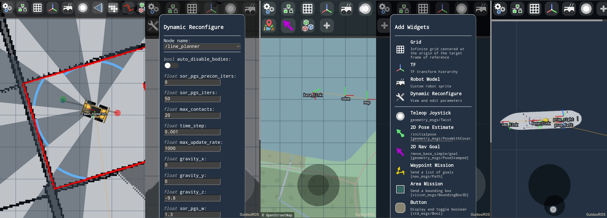
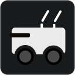
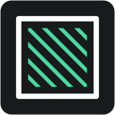
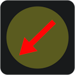
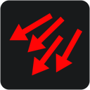

#  Vizanti - Web Visualizer & Mission Planner for ROS

[](https://opensource.org/licenses/BSD-3-Clause) [](https://build.ros.org/job/Ndev__vizanti__ubuntu_focal_amd64/4/)

Vizanti is a web-based visualization and control tool developed for more convenient operation of outdoor robots running the Robot Operating System (ROS). The application attempts to replicate RViz's orthographic 2D view as closely as possible with a smartphone friendly interface. The second goal is to allow planning and executing movement and mission commands, i.e. goals and waypoints, with custom buttons and parameter reconfigure.

 

## Installation

As a field tool, Vizanti is designed to operate just as well without internet access, and as such the intended way is to host it on a robot, with rosbridge autoconnecting to the host IP. 

 ```bash
cd ~/catkin_ws/src
git clone https://github.com/MoffKalast/vizanti.git
cd ..
rosdep install --from-paths src --ignore-src
catkin_make
```

Or if rosdep fails for some reason, these are the main two deps:
```
sudo apt install ros-noetic-rosbridge-suite python3-flask
```
 
Flask and Jinja2 are used for templating, rosbridge is required for socket communication.

## Run
```bash
roslaunch vizanti server.launch
```
The web app can be accessed at `http://<host_ip>:5000`. Client settings are automatically saved in localStorage. The satelite imagery renderer also uses the indexedDB to store tiles for offline use (note that this is IP specific). By default the rosbridge instance also occupies port 5001.

If you're using a mobile device connected to a robot's hotspot that doesn't have internet access, make sure to turn off mobile data. This will prevent Android from sending packets to the wrong gateway.

If you are seeing unusually slow rendering in Chrome on Linux, set "Force color profile" to "sRGB" in `chrome://flags/#force-color-profile`. This should speed up canvas rendering.

----

## Feature list

Aside from the required ones, custom widgets can be added to the navbar to customize functionality for a given robot and test setup.

**Note: Some icons open setup modals instantly, while others use a single press to trigger actions and use a long press to open the modal.**

<details>
<summary> General Tools & Configuration</summary>

####  Global Settings 

Set the background color and the fixed TF frame. Also has a button to reset the camera view to zero and default zoom.


####  Grid 

The adjustable metric grid. Currently renders only in the fixed frame.


####  TF 

Renders TF frames, same options as in RViz for the most part.

####  Robot Model 

Renders a 2D sprite to represent the robot model or any specific TF link. 

####  Dynamic Reconfigure

Adjust configurations of all nodes supporting dynamic reconfigure params. Currently rather slow to load and update, but will make sure parameters are current. It treats ints as floats due to type autodetection problems.

####  Bag Recorder

Recording specified topics by calling rosbag record via proxy.

####  Node Manager

See info printouts of a specific node, kill nodes, launch nodes, that sort of thing.

####  Add new visualizer/widget

Self explanatory.

</details>

<details>
<summary> Mission Planning</summary>

####  Teleop Joystick

Joystick used for publishing Twist messages, can be positioned anywhere on the screen and switched into holonomic mode.

####  2D Pose Estimate

Send the /initialpose for navigation startup. Long press to open setup menu.

####  2D Nav Goal 

Send a /move_base_simple/goal. Long press to open setup menu.

####  Waypoint Mission 

Create missions with multiple waypoints, then send them as a Path message. Single tap to add a point, single tap to remove an existing one, hold and drag to move points. Adding a point on an existing line will add it between those two points. Long press to open setup menu.

####  Area Mission

Drag to select an area and publish it to a PolygonStamped topic. Since the area is a rectangle, the first polygon vertex will be at the cursor press, and the third vertex will be the press released point. Long press to open setup menu.

####  Button

A button with customizable text that displays the last message sent on a Bool topic and sends the inverse to toggle it when pressed. Also supports just sending messages to an Empty topic. Long press to open setup menu.

</details>

<details>
<summary>Data Visualization</summary>

####  Map

Display an OccupancyGrid. Also has some experimental map_server controls for saving and loading maps.

####  Satellite Tiles

Display satelite imagery, by default from OpenStreetMap. Requires a Fix origin with the correct frame in its header.

####  GridCells

Displays a grid of cells.

####  Battery

Display a BatteryState message.

####  Compressed Image

Display a CompressedImage message in a movable box anywhere on the screen. Heavily throttled by default.

####  Marker Array

Visualize a MarkerArray. Currently supported types are ARROW, CUBE, SPHERE, CYLIDER, LINE_STRIP and TEXT_VIEW_FACING. Since each of these widgets adds another canvas layer, it makes more sense to aggregate regular Marker messages into a Marker Array to avoid some of that overhead.

####  Path

Render a Path message for navigation debugging.

####  Range

Render a Range message on the main view. Supports grouping multiple messages onto the same topic, as long as the tf frames are different. 

####  Laser Scan

Display a LaserScan message on the main view. Heavily throttled by default.

####  Point Cloud

Display a PointCloud2 message on the main view. Heavily throttled by default.

####  Pose with Covariance (Stamped)

Display a PoseWithCovarianceStamped message. The covariance rendering is currently experimental and will likely only display correctly for spherical covariance.

####  Pose Array

Display a PoseArray message. Throttled to 15 hz.


####  Temperature

Display a Temperature message. Only as a widget for now, not on the view itself.

</details>

## Contributing

Please see [Contributing.md](Contributing.md) for more information.
