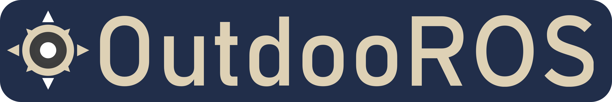

 

[](https://opensource.org/licenses/BSD-3-Clause)

OutdooROS is a web-based visualization and control tool that was developed for more convenient operation of outdoor robots running the Robot Operating System (ROS). The application attempts to replicate RViz's orthographic 2D view as closely as possible with a smartphone friendly interface. The second goal is to allow planning and executing movement and mission commands, i.e. goals and routes, with custom buttons and parameter reconfigure.

## Installation

As a field tool, OutdooROS is designed to operate just as well without internet access, and as such the intended way is to run it off the robot, with rosbridge autoconnecting to the host IP and loading cached data from the robot. 

 ```bash
pip install Flask
sudo apt install ros-noetic-rosbridge-suite

cd ~/catkin_ws/src
git clone https://github.com/MoffKalast/outdooros.git
cd ..
catkin_make

 ```
 
Flask and Jinja2 are used for templating, rosbridge is required for socket communication.

## Run
```bash
roslaunch outdooros server.launch
```
The web app can be accessed at `http://<host_ip>:5000`. Client settings are automatically saved in localStorage. The satelite imagery renderer also uses the indexedDB to store tiles for offline use (note that this is IP specific).

If you're using a mobile device connected to a robot's hotspot that doesn't have internet access, make sure to turn off mobile data. This will prevent Android from sending packets to the wrong gateway.

----

## Feature list

Aside from the required ones, custom widgets can be added to the navbar to customize functionality for a given robot and test setup.

**Note: Some icons open setup modals instantly, while others use a single press to trigger actions and use a long press to open the modal.**

###  Global Settings 

Set the background color and the fixed TF frame. Also has a button to reset the camera view to zero and default zoom.


###  Grid 

The adjustable metric grid. Currently renders only in the fixed frame.


###  TF 

Renders TF frames, same options as in RViz for the most part.

###  Robot Model 

Renders a 2D sprite to represent the robot model or any specific TF link. 

###  Dynamic Reconfigure

Adjust configurations of all nodes supporting dynamic reconfigure params. Currently rather slow to load and update, but will make sure parameters are current. It treats ints as floats due to type autodetection problems.

###  Add new visualizer/widget

Self explanatory.

----

###  Teleop Joystick

Joystick used for publishing Twist messages, can be positioned anywhere on the screen and switched into holonomic mode.

###  2D Pose Estimate

Send the /initialpose for navigation startup. Long press to open setup menu.

###  2D Nav Goal 

Send a /move_base_simple/goal. Long press to open setup menu.

###  Waypoint Mission 

Create missions with multiple waypoints, then send them as a Path message. Long press to open setup menu.

###  Area Mission

Drag to select an area and publish it to a 3DBoundingBox topic. Long press to open setup menu.

###  Button

A button with customizable text that displays the last message sent on a Bool topic and sends the inverse to toggle it when pressed. Long press to open setup menu.

----

###  Map

Display an OccupancyGrid. Also has some experimental map_server controls for saving and loading maps.

###  Satellite Tiles

Display satelite imagery, by default from OpenStreetMap. Requires a Fix origin with the correct frame in its header.

----

###  Battery

Display a BatteryState message.

###  Marker Array

Visualize a MarkerArray. Currently supported types are ARROW, CUBE, SPHERE, CYLIDER, LINE_STRIP and TEXT_VIEW_FACING. Since each of these widgets adds another canvas layer, it makes more sense to aggregate regular Marker messages into a Marker Array to avoid some of that overhead.

###  Path

Render a Path message for navigation debugging.

###  Temperature

Display a Temperature message. Only as a widget for now, not on the view itself.