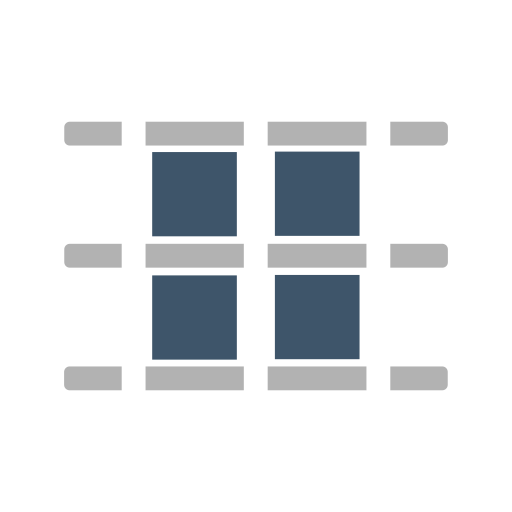

 

[](https://opensource.org/licenses/MIT)

OutdooROS is a web-based visualization tool developed for more convenient operation and control of outdoor robots, particularly UGVs and USVs. The application attempts to replicate RViz's orthographic 2D view as closely as possible with a smartphone friendly interface. The second goal is to allow planning and executing movement and mission commands, i.e. goals and routes, with custom buttons and parameter reconfigure.

## Installation

 ```bash
pip install Flask
sudo apt install ros-noetic-rosbridge-suite
 ```
 
Flask and Jinja2 are used for templating, rosbridge and rosapi are required for socket communication.

## Run
```bash
roslaunch outdooros server.launch
```
The web app can be accessed at `http://<host_ip>:5000`. Client settings are automatically saved in localStorage.

If you're using a mobile device connected to a robot's hotspot that doesn't have internet access, make sure to turn off mobile data. This will prevent Android from sending packets to the wrong gateway.

## Feature list

 TF

 Grid

 Battery

 Temperature

 Joystick

 Robot Model

 Map

 Marker Array

 Simple goal

 Initialpose

 Satelite Tiles

 Dynamic Reconfigure

 Add new visualizer/widget

